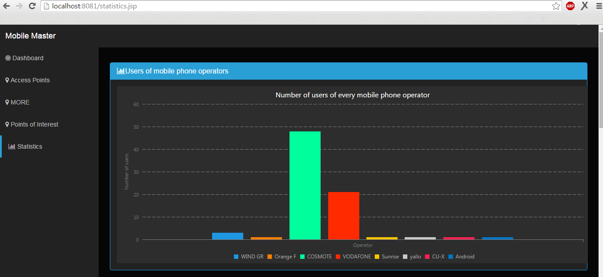

# Full-stack development of a web application for visualisation and analysis of geographic and battery data of users obtained through their mobile phone

Developed in the context of the Network Management course at University of Athens in the spring of 2015 together with Sophia Kypraiou.

## Technologies and frameworks

 Web Application implemented in Java using JavaServer Pages (JSP) and Servlets. For the Front-End we used the Bootstrap library as well as the ShieldUI library for the diagrams.

On the server side, we used Hibernate in order to store and manipulate more easily the datasets, since it offers a mapping between the Java classes and the SQL databases.

On the client side, we used JavaServer Pages to create dynamic web pages, alongside Javascript and jQuery as well as the the Google Map's API.

The communication between server and client was done with Java servlets using POST and GET. To call multiple servlets we used AJAX (Asynchronous JavaScript and XML).
We also used JSON (JavaScript Object Notation) and GeoJSON.

## Purpose 

 The application analyses geolocated data, such as access points and base stations that users connected to, 
 and evaluates stay points and points of interest using DBSCAN algorithm. 
 
## UI examples

Search all the  Access Points and Base Stations a specific user connected to during a time period, as well as the route followed

[Access Points Search](img/search.png)
 
Access Points are displayed as grey dots, Base Stations (Cells) as antennas and the route followed is the purple line.
The user can check specific information about theΑccess Points and the Βase Stations by clicking on them.

 
 Search points of interests 
 

## Some Data

Battery use

Operators

ATH

What happens in Saint-Genis-Pouilly stays in Saint-Genis-Pouilly

